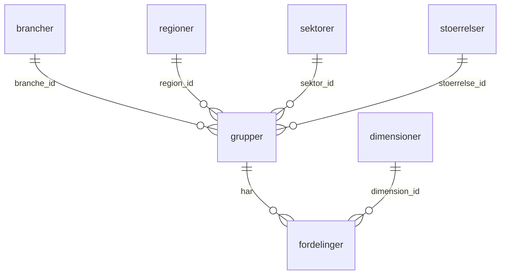

# Data

Referencetallene, delt op i tabeller som i en database. **Tallene er syntetiske** 
(opdigtede), så vi kan bygge barometeret, før de rigtige aggregater fra Danmarks
Statistik ligger klar. Strukturen er den rigtige. Det er kun værdierne, der ikke er.

Når de rigtige tal kommer, får de de samme kolonnenavne. Så virker jeres kode videre.

## Tabellerne

| Fil | Hvad den indeholder | Rækker |
|---|---|---|
| `brancher.csv` | `branche_id`, `branche` | 9 |
| `regioner.csv` | `region_id`, `region` | 6 |
| `sektorer.csv` | `sektor_id`, `sektor` | 3 |
| `stoerrelser.csv` | `stoerrelse_id`, `stoerrelse`, `min_ansatte`, `max_ansatte` | 5 |
| `dimensioner.csv` | `dimension_id`, `dimension`, `navn`, `beskrivelse` | 3 |
| `grupper.csv` | én række pr. sammenligningsgruppe: de fem id'er, `aar`, `antal_arbejdssteder` | 224 |
| `fordelinger.csv` | én række pr. gruppe **og** dimension: `p10` til `p90` | 672 |
| `metadata.csv` | oplysninger om datasættet selv | 7 |



De små tabeller kaldes **opslagstabeller**. De findes, så ordet "Undervisning" kun
står ét sted. Skal det staves om, rettes det ét sted og ikke 672.

## Id 0 betyder "Alle"

I `brancher`, `regioner`, `sektorer` og `stoerrelser` er række 0 værdien `Alle`.
Det er sådan, en bredere sammenligningsgruppe bliver mulig: findes den præcise
kombination ikke, slår man op med `sektor_id = 0`, og derefter med
`stoerrelse_id = 0` også.

## Det, der ikke findes

Lige så vigtigt som det, der er med:

- **Ingen løn.** Rapporten måler ikke løn. Et barometer kan ikke svare på noget, der ikke står i tallene.
- **Ingen kommuner.** Kun regioner. Kommuner ville give så små grupper, at enkelte arbejdspladser kunne genkendes.
- **Ingen navne, CVR-numre eller adresser.** Datasættet indeholder ingen enkelte arbejdspladser overhovedet, kun fordelinger for grupper.
- **Ingen detaljeret aldersfordeling.** Kun andelen på 55 år og derover, som i rapporten.

## Nogle grupper mangler

28 ud af 128 mulige kombinationer af branche, størrelse og sektor er udeladt, fordi
der ville være for få arbejdssteder i dem. Det er ikke en fejl i filen — det er sådan,
offentliggjorte registerdata ser ud.

Prøv for eksempel at slå *Industri, 50-99 ansatte, privat sektor* op i 2022. Den
findes ikke. Jeres kode skal kunne klare det og falde tilbage til en bredere gruppe.

## Sådan sætter I tabellerne sammen

```python
import pandas as pd

fordelinger = pd.read_csv("data/fordelinger.csv")
grupper = pd.read_csv("data/grupper.csv")
brancher = pd.read_csv("data/brancher.csv")

tal = (fordelinger
       .merge(grupper, on="gruppe_id")
       .merge(brancher, on="branche_id"))
```

`merge` sætter to tabeller sammen på en fælles kolonne. Det er den samme operation,
der i en database hedder et **join**.

## Den flade udgave

`data/afledt/referencetal.csv` er alle tabeller sat sammen til én. Den laves af
`lav_fladt.py` og kan altid laves igen, hvorfor den ligger i `afledt/`.

Brug gerne den flade fil, mens I bygger noget, der skal virke i dag. Men lær at sætte
tabellerne sammen selv: det er sådan, rigtige data kommer.

## Hvis I vil lave data om

```bash
python3 data/lav_syntetiske_data.py    # alle tabellerne
python3 data/lav_fladt.py              # den flade udgave
```
